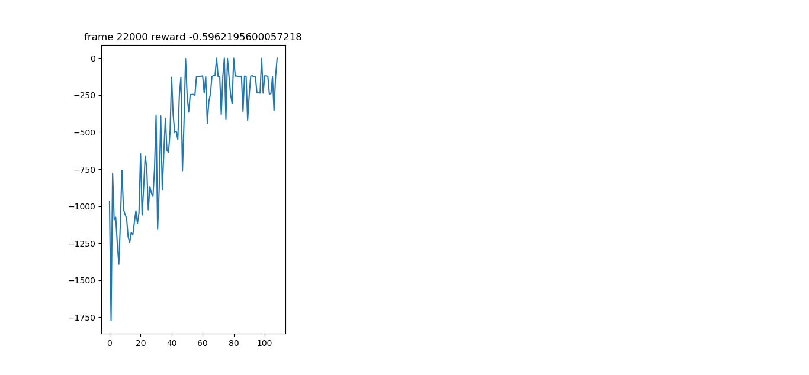
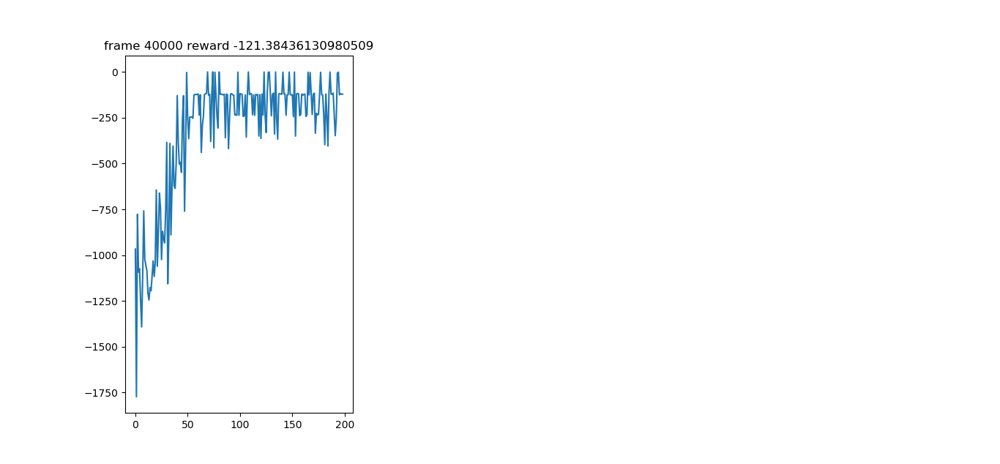

# Soft-Actor-Critic-Pytorch
</br>
[[Paper]](https://arxiv.org/abs/1801.01290)
Soft Actor-Critic: Off-Policy Maximum Entropy Deep Reinforcement Learning with a Stochastic Actor</br>
Tuomas Haarnoja, Aurick Zhou, Pieter Abbeel, Sergey Levine

## Prerequisites
It is a good a practise to create a new virtual environment and then install the dependencies to prevent conflicts with the exsisting ones.</br>
[[Installing and creating virtual envs]](https://packaging.python.org/guides/installing-using-pip-and-virtual-environments/)
- Python 3.6 or higher
- NumPy
- Pytorch 1.0+
- Gym 0.17.2+
- Matplotlib 3.1.1+
- Ipython 7.8.0+
- Pillow 6.2.0+ </br>
Or just run the requirements.txt as ``` pip install -r requirements.py ``` </br>
### Note : 
requiremensts.txt contains packages that may not be used in this project

## Getting Started
- Install [Pytorch](https://pytorch.org/)
- Install torchvision from the source
```
git clone https://github.com/pytorch/vision
cd vision
python setup.py install
```
- Clone this repo (Fork and clone if necessary)
```
git clone https://github.com/rtharungowda/Soft-Actor-Critic-Pytorch.git
cd Soft-Actor-Critic-Pytorch/
```
## Training
To train the models for 40,000 iterations
```
cd pendulumn
python train.py 
```
Iterations midway </br>
All iterations </br>

Load the pre-trained model from checkpoint.pth 
## Visualizing trained model run (This also acts as test)
Create a gif of the test run
```
cd pendulumn
python visualization.py
```
